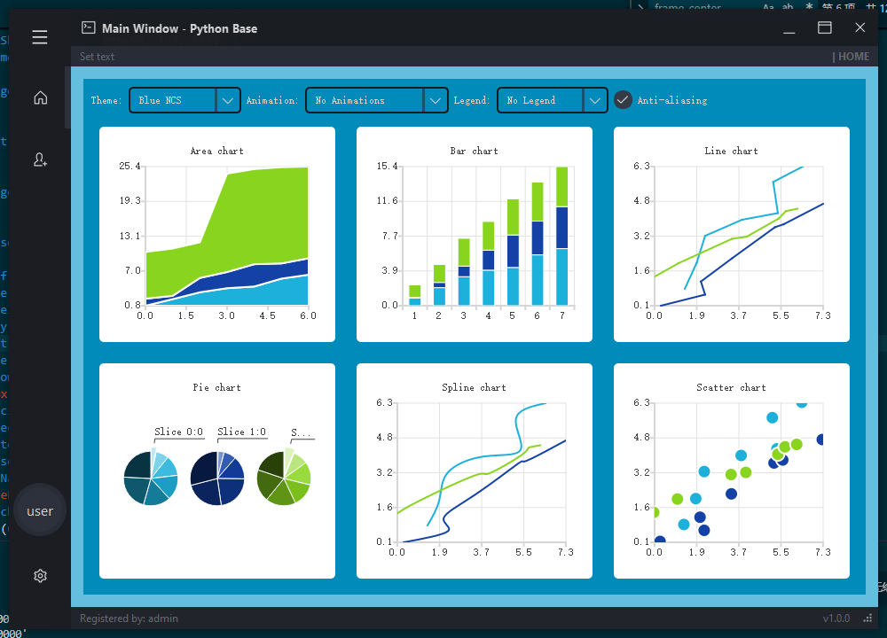
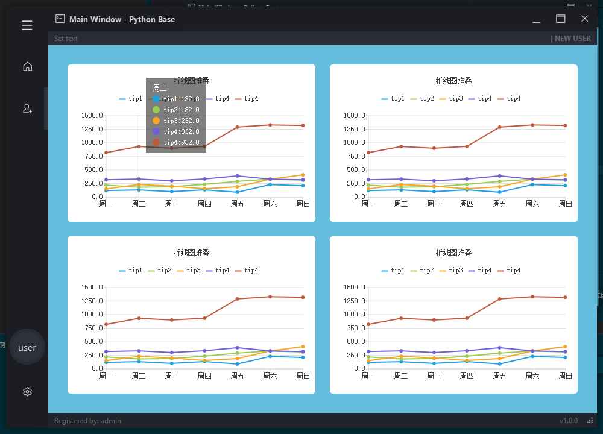
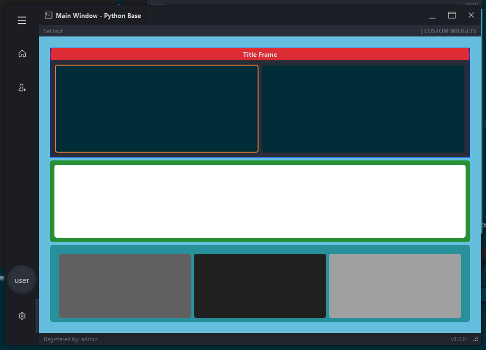

# 这是制作的一个基于pyside2实现的数据可视化展示平台

<p>
<a href="https://www.python.org/">
    
</a>
<a href="https://www.nvidia.cn/geforce/drivers/">
    
</a>
<a href="google.com)](https://mail.google.com/mail/u/0/?hl=zh-CN#inbox">
    
</a>
<a href="https://steamcommunity.com/id/Renee8198504116/">
    
</a>
<a href="">
    
</a>
<a href="">
    
</a>
<a href="">
    
</a>
<a href="">
    
</a>

<a href="">
    
</a>
<a href="">
    
</a>
<a href="">
    
</a>
<a href="">
    
</a>
<a href="">
    
</a>

</p>

## 关于使用PySide2 和 PyQt5

### **PySide2** 和 **PyQt5** 是两种常用的 Python 绑定库，用来实现与 **Qt** 框架的集成。两者的主要功能非常相似，都可以用于开发桌面应用程序，几乎可以实现完美替换再倒包的时候把PyQt5替换成PySide2就可。

## 使用手册

进入项目根目录安装相关依赖

```shell
pip install -r requirment.txt
```

进入项目根目录执行main.py

```python
py main.py
```

使用了几个窗口堆叠去实现不同的数据展示窗口

可以通过预留接口去连接数据库实现数据库的展示

# 目前还在更新中·······（2024/8/1）





预留了一个窗口布局 可以自行更改添加相关组件

# 目前还在更新中·······（2024/8/22）



# 目前还在更新中~~~~~~~~~~（2024/9/11）

相关代码注释已经添加完毕 放心食用！

主要文件

ui_functions.py

- UI 相关功能的 Python 文件，用于定义窗口界面的一些交互逻辑和辅助功能

ui_main.py

- UI布局 使用qt designer 创建

main.py

- 执行文件

LineStack.py

- 使用QTchart实现的线性图  实现了鼠标移动事件点击事件 已经显示动画

ChartThemes.py

- 使用Qtchart z自带的图形工具初始化的图组件

（预实现窗口拖放实现客制化的可视化面板）

frame_center   frame_top_info frame_top_btns  frame_left_menu    frame_toggle(btn_toggle_menu)

